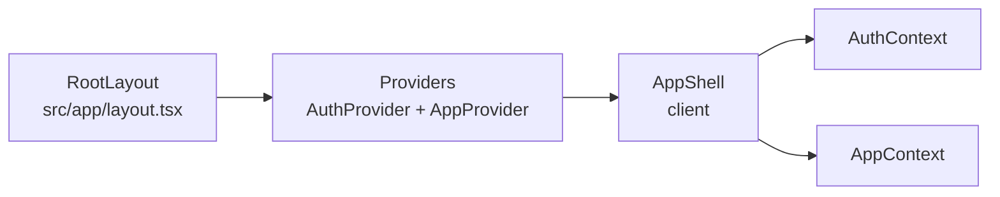
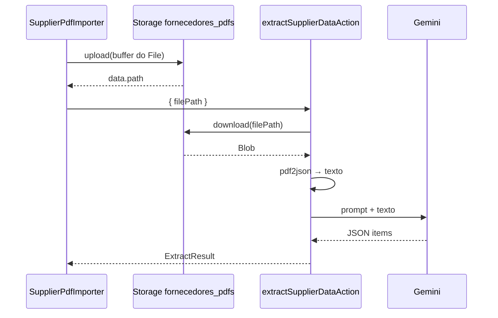

# Arquitetura — OrcaRede (fonte de verdade)

Este documento descreve o estado **atual** do repositório [OrcaRede](.) como referência para implementações futuras. Onde o código TypeScript não versiona schema ou políticas do Postgres, indicamos fontes externas verificadas (scripts SQL irmãos ao repositório ou dump de backup). Não invente comportamentos que não estejam aqui ou nesses artefatos.

---

## 1. Visão geral

- **Framework**: Next.js (App Router), React 19, TypeScript — ver [`package.json`](package.json).
- **Entrada**: [`src/app/layout.tsx`](src/app/layout.tsx) aplica estilos globais e envolve a árvore com [`Providers`](src/providers/Providers.tsx). [`src/app/page.tsx`](src/app/page.tsx) renderiza [`AppShell`](src/components/AppShell.tsx).
- **Shell autenticado**: `AppShell` (`"use client"`) escolhe o módulo ativo (`activeModule`, `currentView`): portal administrativo, dashboard, área de trabalho, configurações, telas de gestão de catálogo, portal do engenheiro, etc.
- **Providers**: `AuthProvider` (sessão Supabase no navegador) → `AppProvider` ([`AppContext`](src/contexts/AppContext.tsx), estado global de dados e operações do orçamento).

---

## 2. Autenticação e sessão JWT

| Camada | Arquivo | Papel |
|--------|---------|--------|
| **Browser** | [`src/lib/supabaseClient.ts`](src/lib/supabaseClient.ts) | `createBrowserClient` com URL e anon key. Usado por [`AuthContext`](src/contexts/AuthContext.tsx) (`getSession`, `onAuthStateChange`) e por [`AppContext`](src/contexts/AppContext.tsx) para queries, Storage e RPCs. |
| **Servidor** | [`src/lib/supabaseServer.ts`](src/lib/supabaseServer.ts) | `createServerClient` com cookies do Next (`cookies()`). Usado **somente** pelas Server Actions em [`src/actions/`](src/actions/). |
| **Middleware** | [`src/middleware.ts`](src/middleware.ts) | Instancia cliente Supabase SSR, chama `getUser()` e propaga cookies na resposta. Não implementa redirecionamento de rotas protegidas além disso. |

Requisições autenticadas enviam o **JWT do usuário**. No Postgres, políticas RLS usuais comparam `auth.uid()` ao `user_id` da linha (ou ownership via orçamento); detalhes SQL estão fora deste repositório (§3).

---
   
## 3. Banco de dados e RLS (multi-tenant)

### 3.1 Evidência no código TypeScript

- Em [`src/types/index.ts`](src/types/index.ts), `user_id` opcional aparece em tipos de catálogo (`Material`, `Concessionaria`, `PostType`).
- [`src/actions/postTypes.ts`](src/actions/postTypes.ts) trata violações de unicidade com constraints `materials_code_user_id_key` e `post_types_code_user_id_key` — alinhado a **unicidade por (código, usuário)** no banco.

### 3.2 O que não está versionado neste repositório

**Não há** pasta `supabase/migrations` nem arquivos `.sql` dentro do OrcaRede. As políticas RLS não são a fonte de verdade no Git deste projeto.

**Script de migração multi-tenant (catálogo)** — fora do repo, caminho típico ao lado deste projeto:

`../Arquivos Sql/migracao_producao.sql`

Esse script documenta, entre outros:

- Colunas `user_id` com `DEFAULT auth.uid()` em `materials`, `utility_companies`, `item_group_templates`, `post_types`.
- Políticas CRUD com `USING` / `WITH CHECK` baseados em `auth.uid() = user_id` para essas tabelas.
- Funções `SECURITY DEFINER` `import_materials_ignore_duplicates` e `delete_all_materials` usando `auth.uid()` e escopo **por usuário**.

### 3.3 Orçamentos, postes e pastas

Um dump de referência (`backup_producao.sql` no mesmo diretório de arquivos SQL) contém `CREATE POLICY` para `budgets`, `budget_posts`, `budget_folders` e tabelas relacionadas, com isolamento por **propriedade** (`user_id` em orçamento/pasta) e regras do tipo “poste só se o orçamento for do usuário”. Para o detalhe exato de cada policy, use esse dump ou o painel Supabase — não listamos policies aqui.

### 3.4 Tabelas e recursos referenciados no código

**Catálogo / templates** (Server Actions e/ou `AppContext`): `materials`, `utility_companies`, `post_types`, `item_group_templates`, `template_materials`.

**Orçamento e canvas** (principalmente `AppContext` + cliente Supabase): `budgets`, `budget_folders`, `budget_posts`, `post_item_groups`, `post_item_group_materials`, `post_materials`.

**Armazenamento**: bucket Supabase Storage `plans` — upload e URL pública em [`AppContext`](src/contexts/AppContext.tsx) (`supabase.storage.from('plans')`), coluna `plan_image_url` em `budgets`.

**Importação de orçamentos de fornecedor (PDF)**: bucket Supabase Storage `fornecedores_pdfs` — o cliente faz upload do arquivo com o [`supabaseClient`](src/lib/supabaseClient.ts) (JWT no navegador); a Server Action [`extractSupplierDataAction`](src/actions/supplierIngestion.ts) usa [`createSupabaseServerClient`](src/lib/supabaseServer.ts) para **baixar** o mesmo objeto por `filePath` e processar no servidor. Esse desenho evita enviar o binário do PDF no corpo da Server Action (limites de payload do Next.js) e mantém o arquivo endereçável por caminho estável.

**Acompanhamento de obra (visualização pública)** — [`src/app/obra/[...slug]/page.tsx`](src/app/obra/[...slug]/page.tsx) normaliza o slug e renderiza [`PublicWorkView`](src/components/PublicWorkViewPremium.tsx) (importado como `PublicWorkView` na página). O componente consulta o cliente Supabase:

- `work_trackings` (por `public_id`),
- `tracked_posts` e `post_connections` (por `tracking_id`).

Tipos: [`WorkTracking`](src/types/index.ts) e relacionados. Há também [`PublicWorkView.tsx`](src/components/PublicWorkView.tsx) (variante legada/alternativa no repositório); a rota `/obra/...` usa **PublicWorkViewPremium**.

---

## 4. RPCs (Remote Procedure Calls) usadas no código

Chamadas `supabase.rpc(...)` encontradas no repositório:

| RPC | Onde | Cliente |
|-----|------|---------|
| `finalize_budget` (`p_budget_id`) | [`finalizeBudgetAction`](src/actions/budgets.ts) | Servidor — [`createSupabaseServerClient`](src/lib/supabaseServer.ts) |
| `delete_all_materials` | [`AppContext`](src/contexts/AppContext.tsx) | Browser — [`supabaseClient`](src/lib/supabaseClient.ts) |
| `import_materials_ignore_duplicates` | [`materialImportService.ts`](src/services/materialImportService.ts), usado pelo fluxo de importação no `AppContext` | Browser |

No servidor, a identidade do usuário vem dos **cookies** da sessão SSR; no cliente, do **JWT** da sessão no navegador. O comportamento de `auth.uid()` dentro das funções `SECURITY DEFINER` de importação/remoção em massa de materiais está descrito em `migracao_producao.sql`.

**Nota:** `get_existing_material_codes` aparece em dumps SQL de produção mas **não** é chamada neste código.

---

## 5. Separação servidor vs cliente (modelo híbrido)

### 5.1 Server Actions (`'use server'` — [`src/actions/`](src/actions/))

A maioria chama `createSupabaseServerClient()` e, em sucesso, `revalidatePath('/')`. Exceções: ações que não persistem estado listado na home (por exemplo [`supplierIngestion.ts`](src/actions/supplierIngestion.ts)) podem omitir `revalidatePath`.

| Módulo | Responsabilidade |
|--------|------------------|
| [`budgets.ts`](src/actions/budgets.ts) | Inserir/atualizar/excluir orçamento; `finalizeBudgetAction` (RPC); `duplicateBudgetAction` (cópia de `budget_posts` e dados aninhados). |
| [`folders.ts`](src/actions/folders.ts) | CRUD de `budget_folders`; mover orçamento entre pastas; mover pasta com verificação de ciclo; ao excluir pasta, reparentar subpastas e limpar `folder_id` em `budgets`. |
| [`materials.ts`](src/actions/materials.ts) | CRUD em `materials`. |
| [`utilityCompanies.ts`](src/actions/utilityCompanies.ts) | CRUD em `utility_companies`; bloqueio de exclusão se houver `budgets` referenciando a concessionária. |
| [`postTypes.ts`](src/actions/postTypes.ts) | CRUD em `post_types` com criação/atualização do registro em `materials` vinculado (`material_id`). |
| [`itemGroups.ts`](src/actions/itemGroups.ts) | CRUD em `item_group_templates` / `template_materials`; no update, sincronização de instâncias em `post_item_groups` / `post_item_group_materials`. |
| [`supplierIngestion.ts`](src/actions/supplierIngestion.ts) | Importação de PDF de fornecedor: download do Storage `fornecedores_pdfs`, extração de texto com **pdf2json** (`PDFParser`), envio do texto bruto ao **Google Gemini** (`GEMINI_API_KEY`) para JSON estruturado de itens (`SupplierItem`). Não usa `revalidatePath` (fluxo isolado da home). |
| [`supplierQuotes.ts`](src/actions/supplierQuotes.ts) | Módulo de suprimentos: criação de cotação e itens, auto-match (`supplier_material_mappings`), conciliação manual, listagem e cenários de compra. Usa `revalidatePath('/fornecedores')` onde aplicável. |

### 5.2 O que permanece no cliente (`AppContext` + `supabaseClient`)

- **Leitura e listagens**: `fetchMaterials`, `fetchBudgets`, `fetchBudgetDetails`, `fetchPostTypes`, `fetchUtilityCompanies`, `fetchItemGroups`, `fetchFolders`, paginação [`fetchAllRecords`](src/contexts/AppContext.tsx), etc. — **não** passam por Server Actions.
- **Manipulação interna do orçamento** (postes no canvas, coordenadas, grupos no poste, materiais em grupo, materiais avulsos, preços consolidados, contadores, nomes customizados): implementada no **cliente** com `.from('budget_posts' | 'post_item_groups' | ...)` e funções expostas no `AppContext` (ex.: `addPostToBudget`, `updatePostCoordinates`, `deletePostFromBudget`, `addGroupToPost`, `removeGroupFromPost`, `updateMaterialQuantityInPostGroup`, `addLooseMaterialToPost`, …).
- **Planta do orçamento**: upload/remoção via Storage `plans` e atualização de `budgets.plan_image_url` no cliente.
- **Importação em lote de materiais**: [`processAndUploadMaterials`](src/services/materialImportService.ts) + RPC no cliente.
- **Funções legacy locais** ainda na interface do contexto (`addGrupoItem`, `updateGrupoItem`, `deleteGrupoItem`, `addOrcamento`, …) coexistem com dados vindos do Supabase.

### 5.3 Onde a UI dispara Server Actions

- [`Dashboard.tsx`](src/components/Dashboard.tsx): `deleteBudgetAction`, `duplicateBudgetAction`, `finalizeBudgetAction`, ações de pastas e movimentação.
- [`CriarOrcamentoModal.tsx`](src/components/modals/CriarOrcamentoModal.tsx): `addBudgetAction`, `updateBudgetAction`.
- [`GerenciarMateriais.tsx`](src/components/GerenciarMateriais.tsx): `addMaterialAction`, `updateMaterialAction`, `deleteMaterialAction`.
- [`GerenciarConcessionarias.tsx`](src/components/GerenciarConcessionarias.tsx): ações de concessionárias.
- [`GerenciarTiposPostes.tsx`](src/components/GerenciarTiposPostes.tsx): ações de tipos de poste.
- [`EditorGrupo.tsx`](src/components/EditorGrupo.tsx), [`GerenciarGrupos.tsx`](src/components/GerenciarGrupos.tsx): ações de grupos de itens (`itemGroups`).
- [`SupplierPdfImporter.tsx`](src/components/SupplierPdfImporter.tsx) (`"use client"`): upload para `fornecedores_pdfs`, `extractSupplierDataAction`, `createSupplierQuoteAction`, `runAutoMatchAction`; navegação para [`/fornecedores`](src/app/fornecedores/page.tsx) com query `tab=conciliar&quoteId=…`; `useTransition` / `startTransition` e estado de salvamento.
- [`ConciliationTable.tsx`](src/components/suppliers/ConciliationTable.tsx), [`PurchaseScenariosPanel.tsx`](src/components/suppliers/PurchaseScenariosPanel.tsx): chamam actions de [`supplierQuotes.ts`](src/actions/supplierQuotes.ts) e atualizam a URL em `/fornecedores?…`.

### 5.4 [`src/services/`](src/services/)

- [`exportService.ts`](src/services/exportService.ts) — exportação (consumo pelo cliente conforme telas).
- [`materialImportService.ts`](src/services/materialImportService.ts) — processamento de planilha e RPC de importação.

Camada de serviço **não** substitui Server Actions; centraliza lógica reutilizável chamada a partir de componentes/`AppContext` no cliente.

---

## 6. Fluxo de estado (`AppContext`)

[`AppContext.tsx`](src/contexts/AppContext.tsx) é o **motor de estado global** para:

- Listas e caches: materiais, orçamentos (`budgets`), detalhe do orçamento (`budgetDetails`), tipos de poste, concessionárias, pastas, grupos de itens, flags de loading.
- **Toda** a persistência interativa do canvas e da área de trabalho descrita em §5.2 (postes, grupos, materiais, planta).

Consumo típico: [`AreaTrabalho`](src/components/AreaTrabalho.tsx), [`CanvasVisual`](src/components/CanvasVisual.tsx), [`PainelContexto`](src/components/PainelContexto.tsx), [`PainelConsolidado`](src/components/PainelConsolidado.tsx), [`EditPostModal`](src/components/modals/EditPostModal.tsx), [`Dashboard`](src/components/Dashboard.tsx), modais de criação de orçamento, etc.

Inicialização depende de [`useAuth`](src/contexts/AuthContext.tsx): com `user` definido, fluxos como `fetchAllCoreData` evitam chamadas sem sessão.

---

## 7. Padrões de UI e ferramentas

- **Estilo**: Tailwind CSS v4 (`tailwindcss`, `@tailwindcss/postcss`); [`clsx`](https://github.com/lukeed/clsx) + [`tailwind-merge`](https://github.com/dcastil/tailwind-merge) em [`src/lib/utils.ts`](src/lib/utils.ts) (`cn`).
- **Ícones**: [`lucide-react`](https://lucide.dev).
- **Componentes primitivos**: estilo alinhado a **Radix UI** — no repositório existem [`alert-dialog`](src/components/ui/alert-dialog.tsx), [`accordion`](src/components/ui/accordion.tsx) e [`tabs`](src/components/ui/tabs.tsx) (`@radix-ui/react-alert-dialog`, `@radix-ui/react-accordion`, `@radix-ui/react-tabs`). Não há catálogo completo “shadcn” instalado; onde útil, trate como padrão shadcn-like só nesses módulos.
- **Canvas / PDF (planta do orçamento)**: `react-pdf`, `pdfjs-dist`, `react-zoom-pan-pinch` em [`CanvasVisual`](src/components/CanvasVisual.tsx).
- **PDF no servidor (texto de fornecedor)**: extração com o pacote [`pdf2json`](https://www.npmjs.com/package/pdf2json) dentro de [`supplierIngestion.ts`](src/actions/supplierIngestion.ts) — distinto do stack de visualização no canvas. **Não** se usa mais `pdf-parse` aqui: com Next.js / Turbopack, o `require` de módulos CommonJS em Server Actions costumava expor `default` em vez da função direta (`pdfParse is not a function`); além disso, `pdf-parse` puxava dependências de ambiente tipo Canvas no Node. O `pdf2json` opera por eventos (`pdfParser_dataError`, `pdfParser_dataReady`) e `parseBuffer`; a função auxiliar `extractTextFromBuffer` encapsula isso numa `Promise` e usa `new PDFParser(null, true)` (texto bruto) e `getRawTextContent()`.
- **Server Actions na UI**: `useTransition` / `startTransition` envolve chamadas assíncronas às actions em telas como [`Dashboard`](src/components/Dashboard.tsx), [`CriarOrcamentoModal`](src/components/modals/CriarOrcamentoModal.tsx), [`GerenciarMateriais`](src/components/GerenciarMateriais.tsx), [`GerenciarConcessionarias`](src/components/GerenciarConcessionarias.tsx), [`GerenciarTiposPostes`](src/components/GerenciarTiposPostes.tsx), [`EditorGrupo`](src/components/EditorGrupo.tsx), [`GerenciarGrupos`](src/components/GerenciarGrupos.tsx), com estados `isPending` quando aplicável.

---

## 8. Estrutura de pastas (resumo)

| Pasta | Conteúdo |
|-------|----------|
| `src/app/` | Rotas App Router (`layout`, `page`, `obra/[...slug]`, `fornecedores/page` — suprimentos em abas, …). |
| `src/actions/` | Server Actions. |
| `src/contexts/` | `AppContext`, `AuthContext`. |
| `src/components/` | UI por feature, `modals/`, `ui/`. |
| `src/lib/` | Cliente/servidor Supabase, utilitários, branding. |
| `src/services/` | Import/export e integrações. |
| `src/types/` | Tipos TypeScript compartilhados. |
| `src/hooks/` | Hooks reutilizáveis. |
| `src/providers/` | Composição de providers. |

---

## 9. Integração com IA e MCP (Model Context Protocol)

O workspace pode expor **ferramentas MCP** (por exemplo, Supabase MCP).

- Sempre que uma nova funcionalidade envolver **banco de dados**, a IA deve **preferir** inspecionar o schema atual das tabelas, assinaturas de RPCs e regras de RLS **diretamente no banco** via MCP, em vez de inferir estrutura apenas a partir dos tipos TypeScript locais.
- Este `ARCHITECTURE.md` e o código descrevem o aplicativo; a fonte de verdade para constraints e policies em produção permanece o **Postgres/Supabase** quando houver divergência.

---

## 10. Suprimentos: PDF de fornecedor, conciliação e cenários

Fluxo de leitura de orçamentos em PDF, persistência de cotações, conciliação com materiais do orçamento e comparação de cenários de compra.

### 10.1 Rota única em abas e parâmetros de URL

A experiência concentra-se em **[`src/app/fornecedores/page.tsx`](src/app/fornecedores/page.tsx)** (Server Component), que carrega dados conforme a query string e delega a UI a **[`FornecedoresSuprimentosShell.tsx`](src/components/suppliers/FornecedoresSuprimentosShell.tsx)** (`"use client"`, Radix **Tabs**).

| Parâmetro | Valores | Uso |
|-----------|---------|-----|
| `tab` | `importar` \| `conciliar` \| `cenarios` | Aba ativa (padrão: `importar`). |
| `quoteId` | UUID | Cotação exibida na aba **Conciliar** (após salvar importação ou link direto). |
| `budgetId` | UUID | Orçamento na aba **Cenários**; o servidor busca cenários quando `tab=cenarios` e `budgetId` estão definidos. |

**Redirecionamentos** (URLs antigas / favoritos): [`fornecedores/importar/page.tsx`](src/app/fornecedores/importar/page.tsx), [`fornecedores/cenarios/page.tsx`](src/app/fornecedores/cenarios/page.tsx) e [`fornecedores/[quoteId]/conciliar/page.tsx`](src/app/fornecedores/[quoteId]/conciliar/page.tsx) apenas fazem `redirect` para `/fornecedores` com os parâmetros equivalentes.

| Artefato | Papel |
|----------|--------|
| [`src/app/fornecedores/page.tsx`](src/app/fornecedores/page.tsx) | Lista `budgets`; se `quoteId`, carrega cotação + materiais do orçamento; se `tab=cenarios` e `budgetId`, carrega cenários e lista de cotações. |
| [`FornecedoresSuprimentosShell.tsx`](src/components/suppliers/FornecedoresSuprimentosShell.tsx) | Abas e `router.replace` ao trocar de aba (preserva `quoteId` / `budgetId` quando presentes). |
| [`SupplierPdfImporter.tsx`](src/components/SupplierPdfImporter.tsx) | Aba **Importar**: PDF, extração IA, salvamento da cotação. |
| [`ConciliationTable.tsx`](src/components/suppliers/ConciliationTable.tsx) | Aba **Conciliar**: vínculo manual, memória De/Para, conclusão → aba Cenários. |
| [`PurchaseScenariosPanel.tsx`](src/components/suppliers/PurchaseScenariosPanel.tsx) | Aba **Cenários**: seleção de orçamento, painéis cenário A/B. |

### 10.2 Fluxo ponta a ponta

1. O usuário escolhe um `.pdf` e clica em **Processar PDF**.
2. O cliente gera um caminho estável, por exemplo `fornecedores/<timestamp>_<nomeOriginal>.pdf`, e faz **upload** para o bucket `fornecedores_pdfs` com [`supabase.storage`](src/lib/supabaseClient.ts) (sessão do usuário no navegador).
3. Com o `data.path` devolvido pelo Storage, o cliente chama **`extractSupplierDataAction({ filePath })`** — apenas o caminho (string), não o binário inteiro na action.
4. No servidor, [`supplierIngestion.ts`](src/actions/supplierIngestion.ts) faz **download** do mesmo objeto com `createSupabaseServerClient()`, monta um `Buffer` e extrai texto com **pdf2json**.
5. O texto bruto é enviado ao **Gemini** (`GEMINI_API_KEY` em variável de ambiente do servidor); a resposta deve ser JSON com a chave `items` alinhada ao tipo `SupplierItem`.

### 10.3 Extração de texto (`pdf2json`)

- Implementação encapsulada em `extractTextFromBuffer(buffer)` na própria action: instancia `PDFParser`, registra `pdfParser_dataError` / `pdfParser_dataReady`, chama `parseBuffer(buffer)` e, no sucesso, usa `getRawTextContent()`.
- **Páginas**: o log de depuração usa `pdfData.Pages.length` após o parse para alinhar com o que antes era `numpages` de outras bibliotecas.
- Se o texto após `trim()` for vazio, a action retorna erro amigável (PDF só-imagem ou ilegível para o parser).

### 10.4 Depuração (logs)

Para isolar falhas (upload vs download vs parse vs IA), o fluxo inclui logs explícitos:

- **Cliente** (`SupplierPdfImporter`): nome e tamanho do arquivo antes do upload; `data.path` após upload (ou erro); objeto `result` completo retornado pela Server Action (útil no DevTools do navegador).
- **Servidor** (`supplierIngestion`): `filePath`, resultado do download Supabase, `buffer.length`, trecho inicial do texto e contagem de páginas após pdf2json, avisos quando o texto vem vazio, e confirmação antes de chamar o Gemini.

Os logs da Server Action aparecem no **terminal** do processo Node (ex.: `next dev` / deploy), não na aba Console do browser.

### 10.5 Variáveis de ambiente

- **`GEMINI_API_KEY`**: obrigatória no servidor para o passo de estruturação dos itens; sem ela a action retorna erro configurável.

### 10.6 Políticas de Storage e RLS

O bucket `fornecedores_pdfs`, políticas de `INSERT`/`SELECT` para o cliente e para o papel usado pelo SSR ao baixar **não** estão detalhados neste repositório como migrations versionadas; conferir no painel Supabase ou em scripts SQL externos ao mesmo nível de §3.2.

---

## 11. Checklist de manutenção deste documento

- [ ] RPCs e tabelas citadas batem com `grep` no repositório.
- [ ] Modelo híbrido (Server Actions vs cliente `AppContext`) permanece claro para novos contribuidores.
- [ ] RLS: separar o que vem do **código** do que vem de **scripts SQL externos** ou do painel Supabase.
