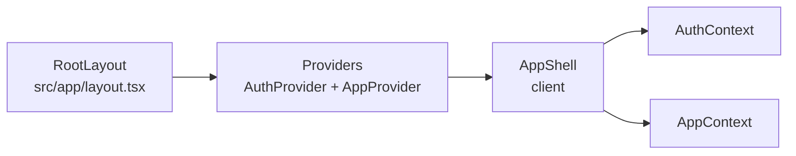
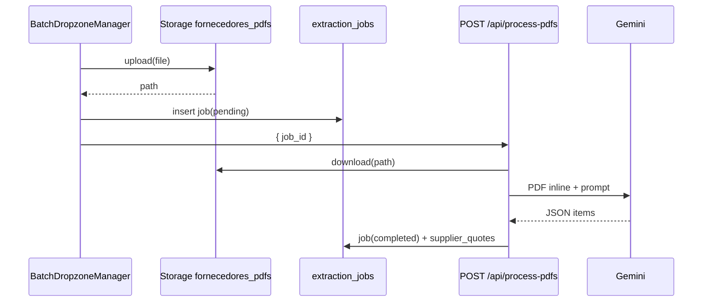

# Arquitetura — OrcaRede (fonte de verdade)

Este documento descreve o estado **atual** do repositório [OrcaRede](.) como referência para implementações futuras. Onde o código TypeScript não versiona schema ou políticas do Postgres, indicamos fontes externas verificadas (scripts SQL irmãos ao repositório ou dump de backup). Não invente comportamentos que não estejam aqui ou nesses artefatos.

---

## 1. Visão geral

- **Framework**: Next.js (App Router), React 19, TypeScript — ver [`package.json`](package.json).
- **Entrada**: [`src/app/layout.tsx`](src/app/layout.tsx) aplica estilos globais e envolve a árvore com [`Providers`](src/providers/Providers.tsx). [`src/app/page.tsx`](src/app/page.tsx) renderiza [`AppShell`](src/components/AppShell.tsx).
- **Shell autenticado**: `AppShell` (`"use client"`) escolhe o módulo ativo (`activeModule`, `currentView`): portal administrativo, dashboard, área de trabalho, configurações, telas de gestão de catálogo, portal do engenheiro, etc.
- **Providers**: `AuthProvider` (sessão Supabase no navegador) → `AppProvider` ([`AppContext`](src/contexts/AppContext.tsx), estado global de dados e operações do orçamento).

---

## 2. Autenticação e sessão JWT

| Camada | Arquivo | Papel |
|--------|---------|--------|
| **Browser** | [`src/lib/supabaseClient.ts`](src/lib/supabaseClient.ts) | `createBrowserClient` com URL e anon key. Usado por [`AuthContext`](src/contexts/AuthContext.tsx) (`getSession`, `onAuthStateChange`) e por [`AppContext`](src/contexts/AppContext.tsx) para queries, Storage e RPCs. |
| **Servidor** | [`src/lib/supabaseServer.ts`](src/lib/supabaseServer.ts) | `createServerClient` com cookies do Next (`cookies()`). Usado **somente** pelas Server Actions em [`src/actions/`](src/actions/). |
| **Middleware** | [`src/middleware.ts`](src/middleware.ts) | Instancia cliente Supabase SSR, chama `getUser()` e propaga cookies na resposta. Não implementa redirecionamento de rotas protegidas além disso. |

Requisições autenticadas enviam o **JWT do usuário**. No Postgres, políticas RLS usuais comparam `auth.uid()` ao `user_id` da linha (ou ownership via orçamento); detalhes SQL estão fora deste repositório (§3).

---
   
## 3. Banco de dados e RLS (multi-tenant)

### 3.1 Evidência no código TypeScript

- Em [`src/types/index.ts`](src/types/index.ts), `user_id` opcional aparece em tipos de catálogo (`Material`, `Concessionaria`, `PostType`).
- [`src/actions/postTypes.ts`](src/actions/postTypes.ts) trata violações de unicidade com constraints `materials_code_user_id_key` e `post_types_code_user_id_key` — alinhado a **unicidade por (código, usuário)** no banco.

### 3.2 Migrações versionadas no repositório

A pasta [`supabase/migrations/`](supabase/migrations/) é a fonte de verdade no Git para o **módulo de fornecedores / suprimentos** e recursos relacionados, incluindo:

- Tabelas `supplier_quotes`, `supplier_quote_items`, `supplier_material_mappings` (evolução inicial em [`20260404000000_supplier_module.sql`](supabase/migrations/20260404000000_supplier_module.sql)).
- **`quotation_sessions`** e **`extraction_jobs`** (sessões com fila assíncrona, Realtime em `extraction_jobs`) — [`20260407120000_quotation_sessions_extraction_jobs.sql`](supabase/migrations/20260407120000_quotation_sessions_extraction_jobs.sql).
- **`supplier_quotes`**: `budget_id` opcional, `session_id`, obrigatoriedade de orçamento **ou** sessão — mesma migration.
- Metadados de match (`match_level`, `match_confidence`, `match_method`), sugestões semânticas (`semantic_match_suggestions`), `extraction_validated_at`, status `ia_suggested` — migrações `2026040910*` e `2026040916*`.
- View **`supplier_price_history`** — preço normalizado para histórico (RF06) — [`20260409104000_create_supplier_price_history_view.sql`](supabase/migrations/20260409104000_create_supplier_price_history_view.sql) (atualizada quando o domínio de `match_status` evolui).
- Bucket e políticas do Storage **`fornecedores_pdfs`** — [`20260404130000_storage_bucket_fornecedores_pdfs.sql`](supabase/migrations/20260404130000_storage_bucket_fornecedores_pdfs.sql), [`20260401120000_storage_fornecedores_pdfs_rls.sql`](supabase/migrations/20260401120000_storage_fornecedores_pdfs_rls.sql).

**Scripts legados fora do repo** (catálogo multi-tenant mais antigo, dumps de produção) podem coexistir: por exemplo `../Arquivos Sql/migracao_producao.sql` para `materials`, `post_types`, RPCs `import_materials_ignore_duplicates` e `delete_all_materials`. O que não estiver em `supabase/migrations/` deve ser tratado como fonte externa.

### 3.3 Orçamentos, postes e pastas

Um dump de referência (`backup_producao.sql` no mesmo diretório de arquivos SQL legados) pode conter `CREATE POLICY` para `budgets`, `budget_posts`, `budget_folders` e tabelas relacionadas. Para o detalhe exato de cada policy, use esse dump ou o painel Supabase — não duplicamos policies aqui.

### 3.4 Tabelas e recursos referenciados no código

**Catálogo / templates** (Server Actions e/ou `AppContext`): `materials`, `utility_companies`, `post_types`, `item_group_templates`, `template_materials`.

**Orçamento e canvas** (principalmente `AppContext` + cliente Supabase): `budgets`, `budget_folders`, `budget_posts`, `post_item_groups`, `post_item_group_materials`, `post_materials`.

**Suprimentos / fornecedores**: `quotation_sessions`, `extraction_jobs`, `supplier_quotes`, `supplier_quote_items`, `supplier_material_mappings`, `semantic_match_suggestions` (auditoria de match por IA).

**Armazenamento**: bucket Supabase Storage `plans` — upload e URL pública em [`AppContext`](src/contexts/AppContext.tsx) (`supabase.storage.from('plans')`), coluna `plan_image_url` em `budgets`.

**Importação de orçamentos de fornecedor (PDF)**: bucket Supabase Storage `fornecedores_pdfs` — o cliente faz upload com o [`supabaseClient`](src/lib/supabaseClient.ts) (JWT no navegador); o processamento no servidor usa **caminho estável** (`file_path`) — fila de jobs chama [`POST /api/process-pdfs`](src/app/api/process-pdfs/route.ts), que baixa o objeto e usa [`runExtractionJob`](src/services/suppliers/runExtractionJob.ts). A Server Action [`extractSupplierDataAction`](src/actions/supplierIngestion.ts) usa o mesmo padrão (download por `filePath`) para o fluxo **importação única** em [`SupplierPdfImporter`](src/components/SupplierPdfImporter.tsx).

**Acompanhamento de obra (visualização pública)** — [`src/app/obra/[...slug]/page.tsx`](src/app/obra/[...slug]/page.tsx) normaliza o slug e renderiza [`PublicWorkView`](src/components/PublicWorkViewPremium.tsx) (importado como `PublicWorkView` na página). O componente consulta o cliente Supabase:

- `work_trackings` (por `public_id`),
- `tracked_posts` e `post_connections` (por `tracking_id`).

Tipos: [`WorkTracking`](src/types/index.ts) e relacionados. Há também [`PublicWorkView.tsx`](src/components/PublicWorkView.tsx) (variante legada/alternativa no repositório); a rota `/obra/...` usa **PublicWorkViewPremium**.

---

## 4. RPCs (Remote Procedure Calls) usadas no código

Chamadas `supabase.rpc(...)` encontradas no repositório:

| RPC | Onde | Cliente |
|-----|------|---------|
| `finalize_budget` (`p_budget_id`) | [`finalizeBudgetAction`](src/actions/budgets.ts) | Servidor — [`createSupabaseServerClient`](src/lib/supabaseServer.ts) |
| `delete_all_materials` | [`AppContext`](src/contexts/AppContext.tsx) | Browser — [`supabaseClient`](src/lib/supabaseClient.ts) |
| `import_materials_ignore_duplicates` | [`materialImportService.ts`](src/services/materialImportService.ts), usado pelo fluxo de importação no `AppContext` | Browser |

No servidor, a identidade do usuário vem dos **cookies** da sessão SSR; no cliente, do **JWT** da sessão no navegador. O comportamento de `auth.uid()` dentro das funções `SECURITY DEFINER` de importação/remoção em massa de materiais está descrito em `migracao_producao.sql`.

**Nota:** `get_existing_material_codes` aparece em dumps SQL de produção mas **não** é chamada neste código.

---

## 5. Separação servidor vs cliente (modelo híbrido)

### 5.1 Server Actions (`'use server'` — [`src/actions/`](src/actions/))

A maioria chama `createSupabaseServerClient()` e, em sucesso, `revalidatePath('/')`. Exceções: ações que não persistem estado listado na home (por exemplo [`supplierIngestion.ts`](src/actions/supplierIngestion.ts)) podem omitir `revalidatePath`.

| Módulo | Responsabilidade |
|--------|------------------|
| [`budgets.ts`](src/actions/budgets.ts) | Inserir/atualizar/excluir orçamento; `finalizeBudgetAction` (RPC); `duplicateBudgetAction` (cópia de `budget_posts` e dados aninhados). |
| [`folders.ts`](src/actions/folders.ts) | CRUD de `budget_folders`; mover orçamento entre pastas; mover pasta com verificação de ciclo; ao excluir pasta, reparentar subpastas e limpar `folder_id` em `budgets`. |
| [`materials.ts`](src/actions/materials.ts) | CRUD em `materials`. |
| [`utilityCompanies.ts`](src/actions/utilityCompanies.ts) | CRUD em `utility_companies`; bloqueio de exclusão se houver `budgets` referenciando a concessionária. |
| [`postTypes.ts`](src/actions/postTypes.ts) | CRUD em `post_types` com criação/atualização do registro em `materials` vinculado (`material_id`). |
| [`itemGroups.ts`](src/actions/itemGroups.ts) | CRUD em `item_group_templates` / `template_materials`; no update, sincronização de instâncias em `post_item_groups` / `post_item_group_materials`. |
| [`supplierIngestion.ts`](src/actions/supplierIngestion.ts) | Importação **single-PDF**: download do Storage `fornecedores_pdfs`, envio do **PDF binário** ao **Google Gemini** (multimodal, [`extractSupplierQuoteWithGemini`](src/services/ai/geminiSupplierQuote.ts)), retorno JSON de itens (`SupplierItem`). Não usa `revalidatePath` (fluxo isolado). |
| [`supplierQuotes.ts`](src/actions/supplierQuotes.ts) | Cotações, auto-match (memória + semântica via serviços), conciliação por sessão, cenários A/B, curadoria. `revalidatePath` em `/fornecedores` e rotas de sessão quando aplicável. |
| [`quotationSessions.ts`](src/actions/quotationSessions.ts) | CRUD de `quotation_sessions`, listagem com estatísticas, jobs de extração por sessão. |

**Route Handler** [`src/app/api/process-pdfs/route.ts`](src/app/api/process-pdfs/route.ts): `POST` com `{ job_id }` — autentica o usuário, carrega o job em `extraction_jobs`, executa [`runExtractionJob`](src/services/suppliers/runExtractionJob.ts) (download PDF, Gemini, persistência da cotação, auto-match e match semântico opcional). Usa `createSupabaseServiceRoleClient` em fallbacks de erro e `after()` do Next para trabalho assíncrono quando necessário.

### 5.2 O que permanece no cliente (`AppContext` + `supabaseClient`)

- **Leitura e listagens**: `fetchMaterials`, `fetchBudgets`, `fetchBudgetDetails`, `fetchPostTypes`, `fetchUtilityCompanies`, `fetchItemGroups`, `fetchFolders`, paginação [`fetchAllRecords`](src/contexts/AppContext.tsx), etc. — **não** passam por Server Actions.
- **Manipulação interna do orçamento** (postes no canvas, coordenadas, grupos no poste, materiais em grupo, materiais avulsos, preços consolidados, contadores, nomes customizados): implementada no **cliente** com `.from('budget_posts' | 'post_item_groups' | ...)` e funções expostas no `AppContext` (ex.: `addPostToBudget`, `updatePostCoordinates`, `deletePostFromBudget`, `addGroupToPost`, `removeGroupFromPost`, `updateMaterialQuantityInPostGroup`, `addLooseMaterialToPost`, …).
- **Planta do orçamento**: upload/remoção via Storage `plans` e atualização de `budgets.plan_image_url` no cliente.
- **Importação em lote de materiais**: [`processAndUploadMaterials`](src/services/materialImportService.ts) + RPC no cliente.
- **Funções legacy locais** ainda na interface do contexto (`addGrupoItem`, `updateGrupoItem`, `deleteGrupoItem`, `addOrcamento`, …) coexistem com dados vindos do Supabase.

### 5.3 Onde a UI dispara Server Actions

- [`Dashboard.tsx`](src/components/Dashboard.tsx): `deleteBudgetAction`, `duplicateBudgetAction`, `finalizeBudgetAction`, ações de pastas e movimentação.
- [`CriarOrcamentoModal.tsx`](src/components/modals/CriarOrcamentoModal.tsx): `addBudgetAction`, `updateBudgetAction`.
- [`GerenciarMateriais.tsx`](src/components/GerenciarMateriais.tsx): `addMaterialAction`, `updateMaterialAction`, `deleteMaterialAction`.
- [`GerenciarConcessionarias.tsx`](src/components/GerenciarConcessionarias.tsx): ações de concessionárias.
- [`GerenciarTiposPostes.tsx`](src/components/GerenciarTiposPostes.tsx): ações de tipos de poste.
- [`EditorGrupo.tsx`](src/components/EditorGrupo.tsx), [`GerenciarGrupos.tsx`](src/components/GerenciarGrupos.tsx): ações de grupos de itens (`itemGroups`).
- [`SupplierPdfImporter.tsx`](src/components/SupplierPdfImporter.tsx) (`"use client"`): fluxo legado de **um PDF por vez** (upload → `extractSupplierDataAction` → `createSupplierQuoteAction` → `runAutoMatchAction`). Pode ser embutido em [`FornecedoresSuprimentosShell`](src/components/suppliers/FornecedoresSuprimentosShell.tsx) (componente **não** usado pela rota principal atual).
- **Fluxo principal de suprimentos**: [`FornecedoresHub`](src/components/suppliers/FornecedoresHub.tsx) em [`/fornecedores`](src/app/fornecedores/page.tsx) (`createQuotationSessionAction`, lista de sessões); sessão em [`/fornecedores/sessao/[sessionId]`](src/app/fornecedores/sessao/[sessionId]/page.tsx) com [`SessionWorkspace`](src/components/suppliers/SessionWorkspace.tsx), [`BatchDropzoneManager`](src/components/suppliers/BatchDropzoneManager.tsx), [`SessionExtractionRealtime`](src/components/suppliers/SessionExtractionRealtime.tsx) e `POST /api/process-pdfs`; conciliação em [`ConciliationCurationModal`](src/components/suppliers/ConciliationCurationModal.tsx) (payload via `getConciliationPayloadBySessionAction`).
- Cenários: [`/fornecedores/sessao/[sessionId]/cenarios`](src/app/fornecedores/sessao/[sessionId]/cenarios/page.tsx) com [`SessionScenariosView`](src/components/suppliers/SessionScenariosView.tsx) e `calculateScenariosAction` — exige `budget_id` na sessão; caso contrário redireciona para a página da sessão.
- [`ConciliationTable.tsx`](src/components/suppliers/ConciliationTable.tsx), [`PurchaseScenariosPanel.tsx`](src/components/suppliers/PurchaseScenariosPanel.tsx): ainda referenciam URLs antigas do tipo `/fornecedores/trabalho?…` em alguns links; a navegação canônica do produto é por **sessão** (`/fornecedores/sessao/...`).

### 5.4 [`src/services/`](src/services/)

- [`exportService.ts`](src/services/exportService.ts) — exportação (Excel/CSV) para fornecedores a partir do painel consolidado.
- [`materialImportService.ts`](src/services/materialImportService.ts) — processamento de planilha e RPC `import_materials_ignore_duplicates` no cliente.
- [`services/ai/geminiSupplierQuote.ts`](src/services/ai/geminiSupplierQuote.ts) — extração estruturada de propostas (PDF inline no Gemini, resposta JSON).
- [`services/ai/semanticMatch.ts`](src/services/ai/semanticMatch.ts) — sugestões de match semântico (filas de extração).
- [`services/suppliers/runExtractionJob.ts`](src/services/suppliers/runExtractionJob.ts) — pipeline de um job: download, Gemini, persistência, auto-match, IA semântica conforme confiança.
- [`services/suppliers/persistSupplierQuoteFromExtraction.ts`](src/services/suppliers/persistSupplierQuoteFromExtraction.ts), [`services/suppliers/autoMatchQuoteItems.ts`](src/services/suppliers/autoMatchQuoteItems.ts) — persistência e cruzamento com `supplier_material_mappings`.

Camada de serviço **não** substitui Server Actions; centraliza lógica reutilizável chamada a partir de actions, API routes e, no cliente, onde já existia o padrão.

---

## 6. Fluxo de estado (`AppContext`)

[`AppContext.tsx`](src/contexts/AppContext.tsx) é o **motor de estado global** para:

- Listas e caches: materiais, orçamentos (`budgets`), detalhe do orçamento (`budgetDetails`), tipos de poste, concessionárias, pastas, grupos de itens, flags de loading.
- **Toda** a persistência interativa do canvas e da área de trabalho descrita em §5.2 (postes, grupos, materiais, planta).

Consumo típico: [`AreaTrabalho`](src/components/AreaTrabalho.tsx), [`CanvasVisual`](src/components/CanvasVisual.tsx), [`PainelContexto`](src/components/PainelContexto.tsx), [`PainelConsolidado`](src/components/PainelConsolidado.tsx), [`EditPostModal`](src/components/modals/EditPostModal.tsx), [`Dashboard`](src/components/Dashboard.tsx), modais de criação de orçamento, etc.

Inicialização depende de [`useAuth`](src/contexts/AuthContext.tsx): com `user` definido, fluxos como `fetchAllCoreData` evitam chamadas sem sessão.

---

## 7. Padrões de UI e ferramentas

- **Estilo**: Tailwind CSS v4 (`tailwindcss`, `@tailwindcss/postcss`); [`clsx`](https://github.com/lukeed/clsx) + [`tailwind-merge`](https://github.com/dcastil/tailwind-merge) em [`src/lib/utils.ts`](src/lib/utils.ts) (`cn`).
- **Ícones**: [`lucide-react`](https://lucide.dev).
- **Componentes primitivos**: estilo alinhado a **Radix UI** — no repositório existem [`alert-dialog`](src/components/ui/alert-dialog.tsx), [`accordion`](src/components/ui/accordion.tsx), [`tabs`](src/components/ui/tabs.tsx), [`dialog`](src/components/ui/dialog.tsx), [`select`](src/components/ui/select.tsx). Não há catálogo completo “shadcn” instalado; trate como padrão shadcn-like nesses módulos.
- **Toasts**: [`sonner`](https://github.com/emilkowalski/sonner) (ex.: conclusão da fila de extração em [`SessionExtractionRealtime`](src/components/suppliers/SessionExtractionRealtime.tsx)).
- **Canvas / PDF (planta do orçamento)**: `react-pdf`, `pdfjs-dist`, `react-zoom-pan-pinch` em [`CanvasVisual`](src/components/CanvasVisual.tsx).
- **PDF no servidor (cotações de fornecedor)**: o binário é enviado ao **Gemini** como `inlineData` (`application/pdf`) em [`geminiSupplierQuote.ts`](src/services/ai/geminiSupplierQuote.ts) — leitura visual/tabela pelo modelo (`gemini-2.5-flash`), sem parser de texto separado no pipeline principal. **Não** há dependência de `pdf2json`/`pdf-parse` no [`package.json`](package.json) para esse fluxo.
- **Server Actions na UI**: `useTransition` / `startTransition` envolve chamadas assíncronas às actions em telas como [`Dashboard`](src/components/Dashboard.tsx), [`CriarOrcamentoModal`](src/components/modals/CriarOrcamentoModal.tsx), [`GerenciarMateriais`](src/components/GerenciarMateriais.tsx), [`GerenciarConcessionarias`](src/components/GerenciarConcessionarias.tsx), [`GerenciarTiposPostes`](src/components/GerenciarTiposPostes.tsx), [`EditorGrupo`](src/components/EditorGrupo.tsx), [`GerenciarGrupos`](src/components/GerenciarGrupos.tsx), com estados `isPending` quando aplicável.

---

## 8. Estrutura de pastas (resumo)

| Pasta | Conteúdo |
|-------|----------|
| `src/app/` | Rotas App Router: `layout`, `page`, `obra/[...slug]`, `fornecedores/page` (hub de sessões), `fornecedores/sessao/[sessionId]/page`, `fornecedores/sessao/[sessionId]/cenarios/page`, `api/process-pdfs/route`. |
| `src/actions/` | Server Actions. |
| `src/contexts/` | `AppContext`, `AuthContext`. |
| `src/components/` | UI por feature, `modals/`, `ui/`. |
| `src/lib/` | Cliente/servidor Supabase, utilitários, branding. |
| `src/services/` | Import/export e integrações. |
| `src/types/` | Tipos TypeScript compartilhados. |
| `src/hooks/` | Hooks reutilizáveis. |
| `src/providers/` | Composição de providers. |

---

## 9. Integração com IA e MCP (Model Context Protocol)

O workspace pode expor **ferramentas MCP** (por exemplo, Supabase MCP).

- Sempre que uma nova funcionalidade envolver **banco de dados**, a IA deve **preferir** inspecionar o schema atual das tabelas, assinaturas de RPCs e regras de RLS **diretamente no banco** via MCP, em vez de inferir estrutura apenas a partir dos tipos TypeScript locais.
- Este `ARCHITECTURE.md` e o código descrevem o aplicativo; a fonte de verdade para constraints e policies em produção permanece o **Postgres/Supabase** quando houver divergência.

---

## 10. Suprimentos: sessões, PDF, conciliação e cenários

Fluxo principal: **sessões de cotação** agrupam várias propostas; upload em lote gera **jobs** assíncronos; extração via **Gemini multimodal** (PDF); conciliação em cascata (memória De/Para → sugestão IA → manual); cenários A/B quando a sessão tem **orçamento** vinculado.

### 10.1 Rotas e superfície da UI

| Rota | Papel |
|------|--------|
| [`/fornecedores`](src/app/fornecedores/page.tsx) | Hub: lista sessões (`listQuotationSessionsWithStatsAction`), orçamentos para o modal de criação; UI [`FornecedoresHub`](src/components/suppliers/FornecedoresHub.tsx). |
| `/fornecedores/sessao/[sessionId]` | Página da sessão: [`SessionWorkspace`](src/components/suppliers/SessionWorkspace.tsx) — upload/fila ([`SessionExtractionRealtime`](src/components/suppliers/SessionExtractionRealtime.tsx), [`BatchDropzoneManager`](src/components/suppliers/BatchDropzoneManager.tsx)), CTA para conciliação ([`ConciliationCurationModal`](src/components/suppliers/ConciliationCurationModal.tsx)) e link para cenários se houver `budget_id`. |
| `/fornecedores/sessao/[sessionId]/cenarios` | Cenários A/B: [`SessionScenariosView`](src/components/suppliers/SessionScenariosView.tsx); se a sessão não tem orçamento, **redirect** para a página da sessão. |

**Fluxo alternativo (legado)** — [`SupplierPdfImporter`](src/components/SupplierPdfImporter.tsx) + [`FornecedoresSuprimentosShell`](src/components/suppliers/FornecedoresSuprimentosShell.tsx): importação única por PDF, **não** é a rota principal do App Router hoje; útil como referência ou embed.

**Acesso ao módulo**: no portal administrativo ([`AdminPortal`](src/components/AdminPortal.tsx)), o tile **Fornecedores** faz `router.push('/fornecedores')` (não passa pelo `AppShell` de catálogo/canvas).

### 10.2 Lote assíncrono (fila de extração)

1. O usuário cria ou abre uma sessão e envia um ou mais PDFs (dropzone). O cliente faz **upload** para `fornecedores_pdfs` e registra linhas em **`extraction_jobs`** (status `pending` / `processing` / `completed` / `error`).
2. O cliente dispara **`POST /api/process-pdfs`** com `{ job_id }` — sem enviar o binário no JSON.
3. O servidor autentica, carrega o job, executa [`runExtractionJob`](src/services/suppliers/runExtractionJob.ts): download do Storage, **`extractSupplierQuoteWithGemini`**, gravação em `supplier_quotes` / `supplier_quote_items`, `autoMatchQuoteItems`, depois match semântico (Gemini) quando aplicável; atualiza o job e associa `quote_id`.
4. A UI assina **`extraction_jobs`** via **Supabase Realtime** na sessão (`SessionExtractionRealtime`); **Sonner** toasts quando a fila conclui.

### 10.3 Importação única (Server Action)

Para testes ou fluxo legado: **`extractSupplierDataAction({ filePath })`** em [`supplierIngestion.ts`](src/actions/supplierIngestion.ts) baixa o PDF e chama o mesmo [`extractSupplierQuoteWithGemini`](src/services/ai/geminiSupplierQuote.ts) usado no job.

### 10.4 Conciliação e domínio de dados

- **Escopo da fonte da verdade**: `runExtractionJob` carrega materiais do orçamento (`post_item_group_materials` / `post_materials`) se `budget_id` da sessão estiver definido; senão, catálogo `materials` do usuário — ver [`loadSystemMaterials`](src/services/suppliers/runExtractionJob.ts).
- **Match**: `supplier_material_mappings` (memória); colunas `match_level`, `match_method` (`exact_memory`, `semantic_ai`, `manual`) e `match_status` incluindo `ia_suggested`; tabela **`semantic_match_suggestions`** para auditoria.
- **Histórico de preços**: view `supplier_price_history` (preço normalizado; exclui itens só em sugestão IA não validada — ver migrações).

### 10.5 Variáveis de ambiente

- **`GEMINI_API_KEY`**: obrigatória no servidor para extração de itens.
- **`SUPABASE_SERVICE_ROLE_KEY`**: usada em [`createSupabaseServiceRoleClient`](src/lib/supabaseServer.ts) para rotas longas / marcação de erro em jobs quando o fluxo precisa contornar limitações de sessão.

### 10.6 Storage e RLS

Políticas e bucket **`fornecedores_pdfs`** estão versionados em [`supabase/migrations/`](supabase/migrations/) (ver §3.2). Ajustes adicionais em produção podem existir no painel Supabase.

---

## 11. Checklist de manutenção deste documento

- [ ] RPCs e tabelas citadas batem com `grep` no repositório.
- [ ] Migrações em `supabase/migrations/` refletem o que o código assume para suprimentos.
- [ ] Modelo híbrido (Server Actions vs cliente `AppContext`) permanece claro para novos contribuidores.
- [ ] RLS: separar o que vem das **migrations** do que vem de **scripts SQL externos** ou do painel Supabase.
