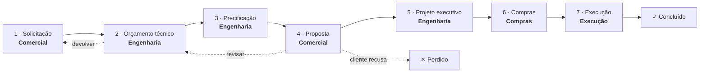

# Plano — Esteira de Trabalho (substitui o Quadro de Trabalho atual)

> Proposta de reescrita do módulo `/tarefas`, entregue em 12/08/2026.
> Contexto: `MD/mapeamentooperacional.md` §3 e §5.1, `MD/PLANO-ORG-MULTITENANCY.md` Fase 4.
> Estado do que existe hoje: 4 migrations (`20260812120000`…`123000`), 12 componentes, 1 task em dev, **nada aplicado em prod**.

---

## 1. Por que o que está lá não serve

Não é questão de acabamento. O modelo está errado em três pontos que nenhum ajuste de CSS resolve.

### 1.1 O sistema não consegue representar a Fase 1 do próprio mapeamento

```sql
budget_id UUID NOT NULL REFERENCES public.budgets(id) ON DELETE RESTRICT
```
— `supabase/migrations/20260812120000_tarefas_core.sql`

O mapeamento diz que o ponto de entrada de **todo** projeto é o Comercial recebendo um cliente (Fase 1), e que o orçamento só nasce depois, na Engenharia (Fase 2). Com `budget_id NOT NULL`, o Comercial **não consegue abrir a primeira demanda** — ele teria que inventar um orçamento antes de ter pedido um.

Na prática isso força o fluxo real de volta pro WhatsApp, que é exatamente o gargalo que o módulo existia pra matar.

### 1.2 Não existe esteira — existem 4 quadros que não se falam

Hoje o board é `setor = quadro`, `status = coluna`. Você escolhe uma aba (Comercial / Engenharia / Compras / Execução) e vê três colunas: Fila, Em andamento, Concluída.

Consequência: **pra saber onde está o job do cliente X você abre 4 abas.** Uma task "concluída" no Comercial e uma "na fila" da Engenharia são a mesma coisa acontecendo, e a tela não mostra isso em lugar nenhum. O `MoveTaskMenu` chama isso de "Passar para o setor" dentro de um popover — o handoff, que é a razão de existir do módulo, é um item de menu escondido.

E o campo que dava sentido ao handoff está morto: a migration criou `transition_note` com um trigger inteiro pra registrar *por que* a task foi passada, e a UI **nunca envia nota nenhuma** (`MoveTaskMenu.tsx:303` → `moveTaskAction({ taskId, ...patch })`). O histórico nasce mudo.

### 1.3 A arquitetura torna animação impossível

Toda mutação é Server Action + `router.refresh()`:

```ts
const result = await moveTaskAction({ taskId, ...patch });
if (result.success) router.refresh();
```

`router.refresh()` re-renderiza a árvore de servidor inteira e **troca o DOM**. Os cards desmontam e remontam. Não existe animação possível sobre isso — não é que falta CSS, é que o nó que você animaria deixou de existir. Some com isso e o resto vem junto: nada de otimista, nada de FLIP, nada de drag.

Junto disso: `tasks` está na publication do Realtime desde a migration, mas **o board nunca assina** (só o chat assina `task_messages`). Colega move um card, sua tela não sabe.

### 1.4 O resto (menor, mas real)

| | |
|---|---|
| **Sem anexos** | Adiado na migration de chat. Mas o briefing do Comercial *é* um PDF/foto do local, e o retorno da Engenharia *é* um arquivo. Sem isso o chat vira "manda no zap que eu te mando o arquivo". |
| **Chat visível pra menos gente que a task** | `tasks_select` libera pra org inteira; `task_messages_select` exige `is_task_member()`. Quem fez o handoff continua vendo *onde* a task está mas perde a conversa. Contradiz a camada de org inteira (commits `bc366c1`, `037996c`). |
| **Máquina de spam de notificação** | `tasks_seed_members` adiciona **todos** os membros ativos do setor de destino a cada handoff, e `on_new_task_message_notify` notifica todo `task_member`. Depois de 3 handoffs, toda mensagem de toda task notifica a empresa inteira. Ninguém vai olhar o sino em duas semanas. |
| **Sem ordenação** | `ORDER BY last_activity_at DESC`. Não dá pra priorizar nada — não existe coluna de posição, então arrastar pra reordenar não teria onde persistir. |
| **Sem "as minhas"** | Não existe visão do que *eu* devo. Abre o board do setor e se vira. |
| **Card abre em outra página** | `/tarefas/[taskId]` é navegação cheia — você perde o board pra ler uma observação. |
| **Status que ninguém mantém** | "Fila" vs "Em andamento" é escrituração manual. Na vida real ninguém volta no sistema pra mudar de fila pra andamento. |

---

## 2. A proposta

**Uma esteira só, horizontal, com o job inteiro visível.** O card é a demanda do cliente e caminha da esquerda pra direita, trocando de setor. Arrastar é o handoff.

### 2.1 As colunas são as etapas — e cada etapa tem um setor dono



| # | Etapa | Setor dono | Fase do mapeamento | Ação primária do card |
|---|---|---|---|---|
| 1 | Solicitação | Comercial | Fase 1 | Briefing: cliente, local, concessionária, prazo, anexos |
| 2 | Orçamento técnico | Engenharia | Fase 2 | **Criar/abrir orçamento** → `/orcamentos/[id]/projeto` |
| 3 | Precificação | Engenharia | Fase 3 | `/orcamentos/[id]/precificacao` |
| 4 | Proposta | Comercial | Fases 4–5 | `/orcamentos/[id]/proposta` · link público · aceite |
| 5 | Projeto executivo | Engenharia | Fase 5 | Projeto + orçamento de implementação |
| 6 | Compras | Compras | Fase 6 | Ordem de compra (hoje manual, depois GestãoClick) |
| 7 | Execução | Execução | Fase 7 | **Abrir obra** → `/tools/andamento-obra/[workId]` |
| — | Concluído / Perdido | — | terminal | colunas colapsadas por padrão |

O cabeçalho de cada coluna é tingido pelo setor dono. Lendo a faixa de cima você enxerga o ping-pong **Comercial → Engenharia → Comercial → Engenharia** que é o coração da operação — hoje invisível.

**Movimento é livre nos dois sentidos.** Arrastar pra direita é avançar, pra esquerda é devolver, e pular etapa é permitido (nem todo job passa por Compras). O mapeamento é explícito: "Engenharia entrega e passa de volta para Comercial ou para Compras". Nenhuma máquina de estados — só registro obrigatório de toda transição, que é o que já existe e funciona.

**Devolver pede motivo.** Arrastar pra esquerda abre um campo de nota antes de confirmar. É o único momento em que a nota é obrigatória, e é o que dá conteúdo ao `transition_note` que hoje nasce vazio.

> **Por que enum fixo e não etapas configuráveis por org.** Cada etapa tem comportamento amarrado em código: qual módulo ela abre, qual trigger avança ela sozinha, qual setor ela notifica. Etapa configurável com comportamento fixo é o pior dos dois mundos. Mudar a lista depois é uma migration de uma linha.

### 2.2 Estado do card: some com "Fila / Em andamento / Concluída"

Substituído por três coisas que se mantêm sozinhas:

- **Sem responsável** → "aguardando alguém pegar" (pill âmbar). Ninguém precisa marcar nada.
- **Com responsável** → em andamento. Pegar a tarefa *é* começar.
- **`blocked_reason` preenchido** → travada, com o motivo no card (faixa vermelha). É o estado mais comum da vida real — "esperando o cliente responder", "esperando a concessionária" — e nenhum kanban modela. Aqui modela.

"Concluída" deixa de ser status: sair da etapa **é** concluir a etapa.

### 2.3 A task solta continua existindo

Nem todo trabalho é um job de cliente ("renovar ART", "cotar cabo pra estoque"). A esteira continua sendo a visão principal, mas a mesma tabela aceita card **avulso** (`stage = null`, com setor direto), que aparece numa faixa "Avulsas" abaixo da esteira. Mesmo card, mesmo chat, mesmos anexos.

### 2.4 As três visões

| Visão | O que mostra |
|---|---|
| **Esteira** (padrão) | Todas as etapas. Filtro "só o meu setor" realça as colunas do meu setor e apaga as outras — sem esconder, porque enxergar o vizinho é o ponto. |
| **Minhas** | Tudo que tem meu nome, em qualquer etapa, ordenado por prazo. Primeira tela do dia. |
| **Por cliente/obra** | Agrupado por `budget_id`. A linha do tempo de um job só. |

---

## 3. O card aberto — o "Trello por dentro"

Abre em **modal por cima do board** (Next.js intercepting route `@card/(.)tarefas/[taskId]`), com a esteira viva atrás. O deep link `/tarefas/[taskId]` continua abrindo a página cheia — mesmo componente, dois envelopes.

```
┌───────────────────────────────────────────────┬──────────────────┐
│  Ampliação de rede — Loteamento Vila Nova     │  Etapa           │
│  🏷 Orçamento técnico · Engenharia            │  [ 2 · Orçam. ▾] │
│                                               │                  │
│  Descrição (edição inline, salva no blur)     │  Responsável     │
│  ...                                          │  [ Assumir     ] │
│                                               │                  │
│  ── Anexos (4) ──────────────────────────     │  Prazo           │
│  [img] [img] [pdf] [+ arraste aqui]           │  [ 20/08/2026  ] │
│                                               │                  │
│  ── Atividade ───────────────────────────     │  Orçamento       │
│  ⇢ Ana passou de Comercial → Engenharia       │  → abrir no      │
│    "planta em anexo, prazo apertado"          │    OrçaRede      │
│  💬 Luan: falta a carta da RGE                 │                  │
│  📎 Luan anexou planta-rev2.pdf                │  🔴 Travada      │
│  💬 Ana: pedi hoje, chega quinta               │  esperando RGE   │
│                                               │                  │
│  [ Escrever…                        📎  ➤ ]   │                  │
└───────────────────────────────────────────────┴──────────────────┘
```

**Atividade é uma linha do tempo só.** Hoje são duas caixas separadas — "Histórico" de um lado, "Conversa" do outro — e é impossível saber que a mensagem "falta a carta da RGE" veio *depois* do handoff. Mensagens, transições, uploads, mudanças de prazo e bloqueios entram no mesmo fio, em ordem. É como Trello e Linear fazem, e é o único jeito de a conversa ter contexto.

**Anexos: duas portas, um lugar.** Arrastar arquivo em cima do card (ou colar da área de transferência, ou o clipe do chat) — tudo cai na mesma grade e aparece na atividade. Foto abre em lightbox; PDF abre em aba.

---

## 4. Modelo de dados

Como prod não tem nada e dev tem 1 task de teste, a recomendação é **reescrever as 4 migrations de 12/08** em vez de empilhar `ALTER` em cima de um modelo errado. Mesma numeração, conteúdo novo — a branch ainda não foi mergeada.

### 4.1 `tasks` — o que muda

```sql
-- SAI
budget_id  UUID NOT NULL          -- impede a Fase 1
status     TEXT ('fila'|'andamento'|'concluida')

-- ENTRA
budget_id      UUID NULL REFERENCES public.budgets(id) ON DELETE SET NULL,
stage          TEXT NULL CHECK (stage IN (
                 'solicitacao','orcamento','precificacao','proposta',
                 'projeto_executivo','compras','execucao','concluido','perdido')),
position       NUMERIC NOT NULL DEFAULT 1000,   -- ordem dentro da coluna
blocked_reason TEXT NULL,
client_name    TEXT NULL,        -- a demanda existe antes do orçamento
work_id        UUID NULL REFERENCES public.works(id) ON DELETE SET NULL,

-- CONTINUA
sector, title, description, assigned_to, due_date, created_by,
transition_note, last_activity_at, org_id, created_at, updated_at
```

`sector` **permanece**, derivado da etapa pelo trigger — é ele que alimenta notificação, `current_org_sector()` e o filtro "meu setor", tudo já construído. `stage NULL` = card avulso.

**`position` numérica com inserção no ponto médio:** soltar entre A (1000) e B (2000) grava 1500. Um `UPDATE` por drag, não a coluna inteira. Quando o intervalo fica abaixo de `0.0001`, um `rebalance_task_positions(stage)` reescreve a coluna em 1000, 2000, 3000… (acontece raramente e é barato numa coluna de dezenas de cards).

### 4.2 `task_attachments` — nova

```sql
CREATE TABLE public.task_attachments (
  id           UUID PRIMARY KEY DEFAULT gen_random_uuid(),
  task_id      UUID NOT NULL REFERENCES public.tasks(id) ON DELETE CASCADE,
  org_id       UUID NOT NULL DEFAULT public.current_org_id(),
  message_id   UUID NULL REFERENCES public.task_messages(id) ON DELETE CASCADE,
  uploaded_by  UUID NOT NULL DEFAULT auth.uid(),
  storage_path TEXT NOT NULL,
  file_name    TEXT NOT NULL,
  mime_type    TEXT NULL,
  file_size    BIGINT NULL,
  width        INT NULL,
  height       INT NULL,
  created_at   TIMESTAMPTZ NOT NULL DEFAULT now()
);
```

`message_id NULL` é o truque que faz as duas portas caírem no mesmo lugar: anexo do card tem `NULL`, foto mandada no chat aponta pra mensagem. A grade de anexos lê os dois; a atividade mostra o segundo como bolha.

**Bucket `tarefas`, privado.** Path `{org_id}/{task_id}/{uuid}-{nome}`. Policy de storage por `(storage.foldername(name))[1] = current_org_id()::text` — o mesmo desenho de `andamento-obra`, que já é privado e usa URL assinada (`useSignedUrlWithFallback` já existe e é reaproveitado direto). **Não** copiar o `proposal-media`, que é público de propósito porque alimenta a página pública da proposta; aqui não tem essa necessidade e foto de obra de cliente não deve ficar aberta por URL.

**Upload vai do browser direto pro Storage**, não por Server Action. Server Action na Vercel tem teto de 4.5 MB de body — foto de celular estoura isso sozinha. O browser sobe pro bucket com barra de progresso e só então uma Server Action registra a linha.

### 4.3 Chat e notificação — corrigir os dois defeitos

**Leitura do chat vira org-wide.** `task_messages_select` passa a usar `org_id = current_org_id()`, igual à task. A camada de org inteira foi construída pra que o dado seja da empresa; um chat escondido dentro dela é uma contradição que só gera "não consigo ver a conversa, me manda print".

**`task_members` vira lista de seguidores**, e só serve pra decidir quem é notificado:
- entra: quem criou, quem está como responsável, quem comentou, quem foi @mencionado;
- **não** entra mais o setor inteiro a cada handoff.

O handoff notifica o setor de destino **uma vez** (é o evento que importa: "chegou trabalho pra vocês"). Mensagem de chat notifica só quem segue. Sem isso o sino morre por excesso em duas semanas — hoje ele morre.

### 4.4 Automação: a esteira anda sozinha onde já dá

| Gatilho existente | Efeito |
|---|---|
| Orçamento criado a partir do card | preenche `budget_id`, avança pra **Orçamento técnico** |
| Precificação salva como principal (`saved_pricing_budgets`) | avança pra **Precificação** ✓ e libera **Proposta** |
| Proposta publicada | avança pra **Proposta** |
| **Cliente aceita na página pública** | avança pra **Projeto executivo** e notifica a Engenharia |
| Obra criada em Andamento de Obra | preenche `work_id`, avança pra **Execução** |

O aceite do cliente é pedido nominalmente pelo mapeamento (§5.2: "cliente clica, confirma, e isso dispara automaticamente a abertura da task na Engenharia"). É um trigger em `proposals`. Cada automação é opcional e independente — a esteira funciona 100% manual sem nenhuma delas.

---

## 5. Arquitetura de tela — o que destrava a animação

A mudança que faz todo o resto ser possível:

```
Server Component  →  carrega a esteira inteira uma vez (initialData)
        ↓
BoardProvider (client)  →  DONO do estado do board
        ↓                   • mutação é otimista: o card move na hora
        ↓                   • Server Action roda em background
        ↓                   • erro → desfaz e mostra toast
        ↓
Realtime (tasks, org_id=eq.…)  →  reconcilia mudança de colega
                                   com FLIP, sem remontar nada
```

**`router.refresh()` sai do módulo.** É ele que hoje desmonta os cards. Sem estado no cliente não existe drag decente, não existe otimista, não existe animação — e é por isso que essa é a primeira coisa a mudar, não a última.

---

## 6. Animação — a especificação

O design system já manda o tom: sombra quente e baixa, sem gradiente, `prefers-reduced-motion` respeitado globalmente. A animação aqui segue a mesma contenção — ela existe pra dizer *o que aconteceu com o quê*, não pra enfeitar.

**Nada de Framer Motion.** O repo não tem, são ~50 KB de bundle, e todo movimento abaixo é transform/opacity — o que a Web Animations API e o CSS fazem nativo, com o `@dnd-kit/dom` cuidando da parte difícil.

| Momento | Como | Duração / curva |
|---|---|---|
| **Pegar o card** | `scale(1.02)` + `rotate(1.5deg)` + sombra sobe pro degrau de hover; o buraco de origem vira contorno tracejado | 120 ms · `ease-out` |
| **Arrastando** | segue o ponteiro **sem transição** (transição aqui é o erro clássico: o card fica com "elástico" e parece travado) | — |
| **Vizinhos abrindo espaço** | transform dos irmãos, nunca `margin`/`height` (fora da main thread) | 200 ms · `cubic-bezier(.2,0,0,1)` |
| **Coluna sob o card** | fundo `accent-50` + anel interno tracejado `accent-300` | 150 ms · `ease-out` |
| **Soltar** | voa pro lugar final e, ao pousar, um anel `accent-500` que apaga | 220 ms + flash 400 ms |
| **Devolver (pra esquerda)** | mesmo movimento, flash **âmbar** — devolução é evento diferente de avanço e a cor diz isso sem texto | 220 ms |
| **Card chegando via Realtime** | entra com `opacity 0→1` + `translateY(-6px)`, e os vizinhos reacomodam por **FLIP** | 200 ms |
| **Card saindo** | `opacity → 0` + `scale(.97)`, e só então a coluna fecha o vão | 160 ms |
| **Contador da coluna** | conta animada só quando o número muda por ação de outra pessoa | 300 ms |
| **Modal do card** | escala `.97→1` + fade do véu (`--animate-drawer-in`/`overlay-in`, que já existem no `globals.css`) | 250 ms |
| **Mensagem nova no chat** | bolha entra com `translateY(8px)` + fade; auto-scroll só se você já estava no fim | 180 ms |
| **Upload** | miniatura aparece na hora em `opacity .5` com anel de progresso; ao concluir, satura pra 1 | — |

**A regra que separa animação boa de ruim aqui:** só anima o que o usuário pode causar. Card que se mexe sozinho na carga da página é ruído. Card que se mexe porque a Ana acabou de passar pra você é informação.

E `prefers-reduced-motion` já é global no `globals.css` (linha 644) — o drag continua funcionando, só perde os transforms decorativos.

---

## 7. dnd-kit — qual pacote

Você citou `@dnd-kit/react`. Checado agora no npm:

| Pacote | Versão | Situação |
|---|---|---|
| `@dnd-kit/react` + `@dnd-kit/dom` | **0.5.0** | reescrita nova, pré-1.0, peer React 19 ✓ |
| `@dnd-kit/core` + `@dnd-kit/sortable` | 6.3.1 / 10.0.0 | estável, consolidado, React 19 ✓ |

**Recomendação: `@dnd-kit/react`** — e não só porque foi o que você pensou.

O `@dnd-kit/dom` que vem junto traz um motor de animação FLIP embutido e move o DOM de forma otimista por padrão. Traduzindo: metade da tabela da seção 6 (reacomodação dos vizinhos, voo até o destino, entrada/saída) vem pronta, em vez de eu escrever um hook FLIP na mão. Ele também resolve mover entre colunas sem a dança de `onDragOver` que o `core` exige — que é justamente onde a maioria dos kanbans com dnd-kit fica bugado.

O risco de pré-1.0 é real, mas fica contido em **um** componente (`<EsteiraBoard>`); se a API virar, é um arquivo pra ajustar. Se preferir zero risco, `core + sortable` faz o mesmo com mais código e eu escrevo o FLIP à mão — diz e eu vou por ali.

```bash
npm install @dnd-kit/react
```

---

## 8. Execução — 5 fases

Cada uma fecha em si e é testável. Nada de aplicar migration em prod (regra §3.2 do escopo — migrations são entregues, não aplicadas).

| Fase | Entrega | Peso |
|---|---|---|
| **1 · Modelo** | Reescreve as 4 migrations: `stage`/`position`/`blocked_reason`/`client_name`, `budget_id` nulável, `task_attachments` + bucket, RLS do chat org-wide, seguidores no lugar do setor inteiro | M |
| **2 · Esteira estática** | Board horizontal de 9 colunas, cabeçalho por setor, filtro meu-setor/minhas, card novo, estado no cliente com mutação otimista, Realtime ligado. **Ainda sem drag** — botões de avançar/devolver | G |
| **3 · Drag + animação** | `@dnd-kit/react`, reordenação com `position`, arrastar entre colunas, nota obrigatória ao devolver, a tabela da §6 inteira | M |
| **4 · Card por dentro** | Modal por intercepting route, atividade unificada, anexos (drag-to-upload, colar, lightbox), chat com anexo, edição inline | G |
| **5 · Automação** | Criar orçamento a partir do card, avanço por aceite de proposta, abrir obra, deep links por etapa | M |

Fase 1 + 2 já entregam mais valor que o módulo inteiro de hoje. Dá pra parar ali e avaliar antes de seguir.

---

## 9. Três decisões que preciso de você

1. **9 colunas ou 7?** A esteira acima separa Orçamento técnico / Precificação / Projeto executivo (as três da Engenharia). É fiel ao mapeamento, mas é coluna. Dá pra fundir em **"Engenharia"** com sub-etapa dentro do card — menos rolagem horizontal, menos granularidade no board. Meu voto: **manter as 9**, porque "está na precificação" e "está no projeto executivo" são respostas diferentes quando o cliente liga.

2. **Chat visível pra org inteira?** Minha recomendação é sim (§4.3), coerente com a camada de org. Se você quiser que exista conversa reservada entre dois setores, é outro desenho e eu ajusto.

3. **Reescrever as migrations ou empilhar `ALTER`?** Recomendo reescrever — prod não tem nada, dev tem 1 task de teste, e o histórico da branch fica limpo. Se essa branch já foi mostrada pro Luan como entregue, eu empilho.

---

*Escrito em 12/08/2026 · substitui a Fase 4 de `MD/PLANO-ORG-MULTITENANCY.md`*
