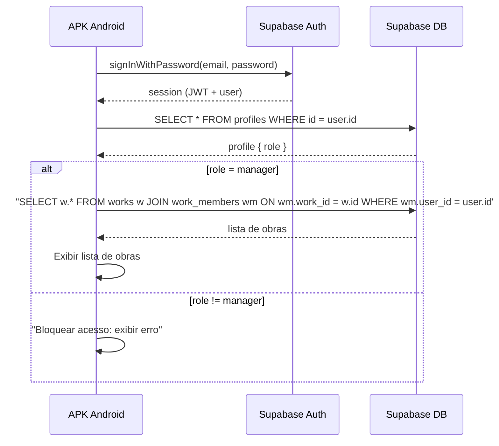
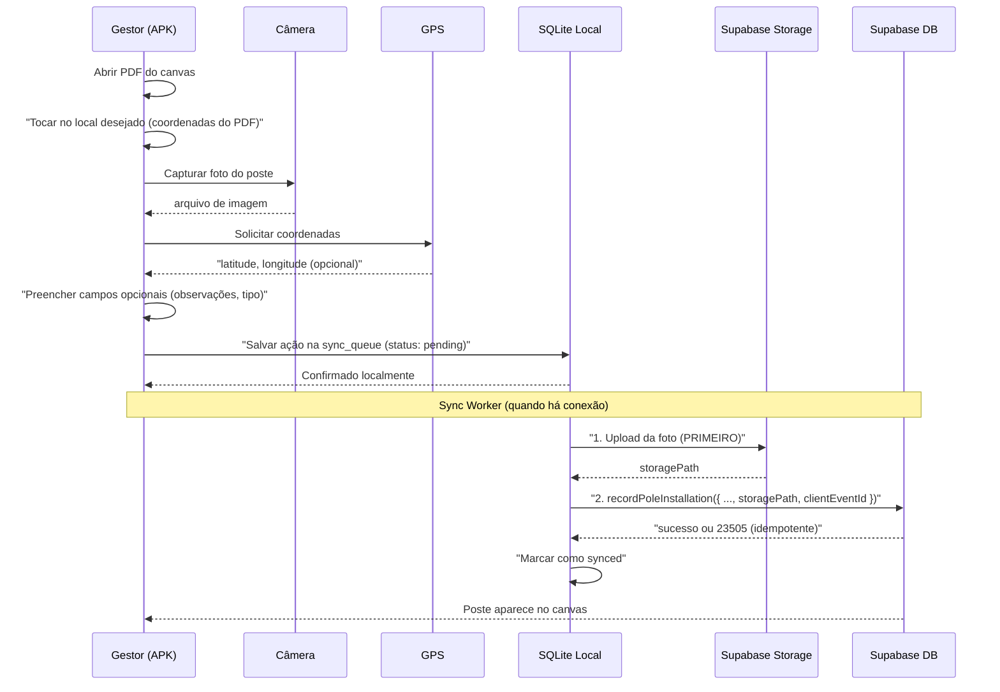
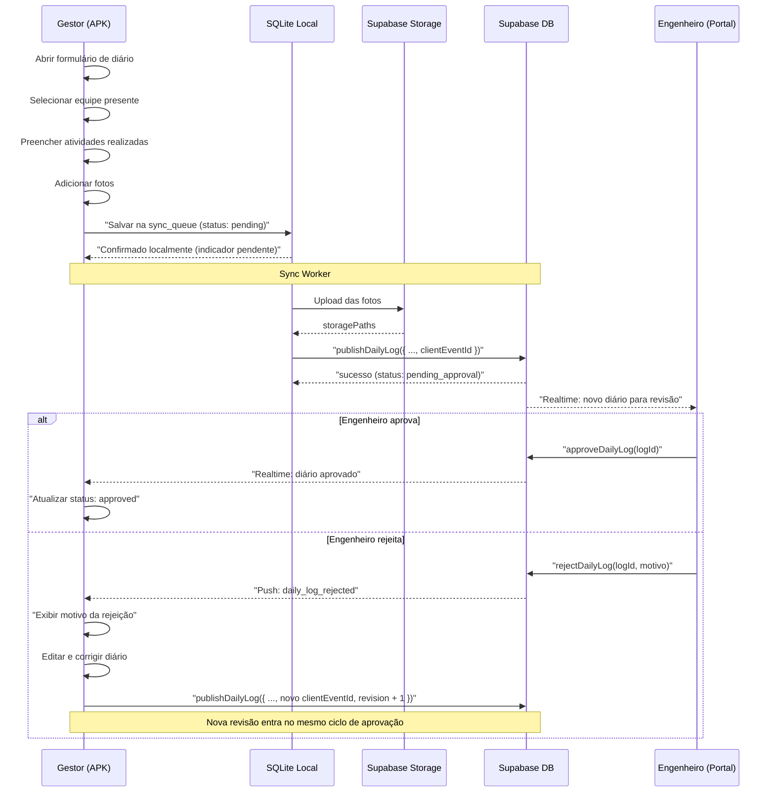
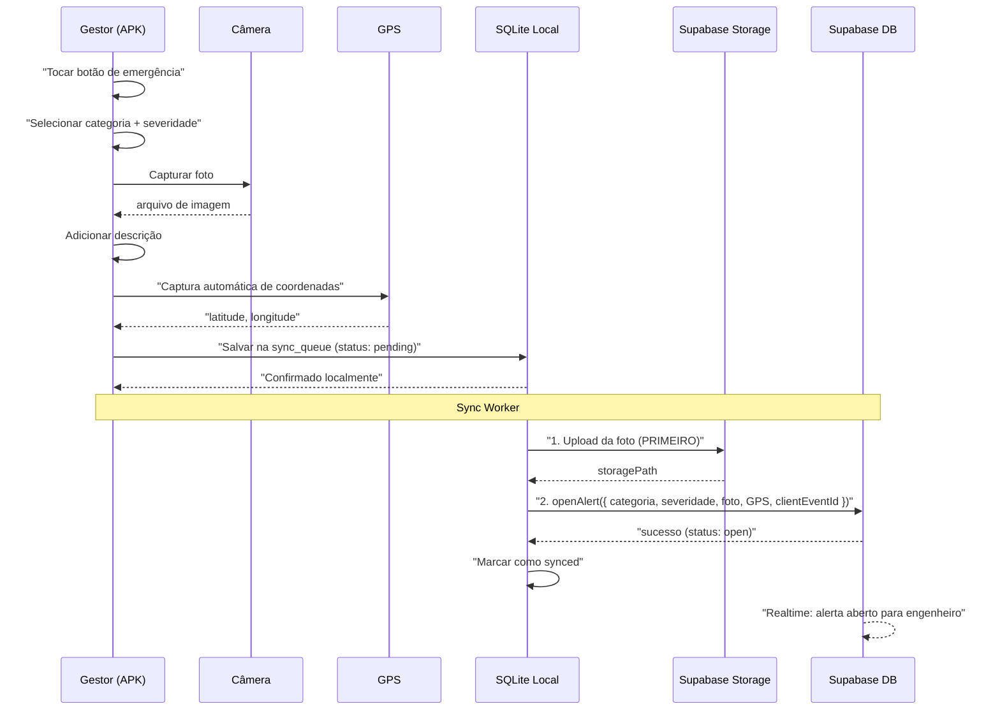
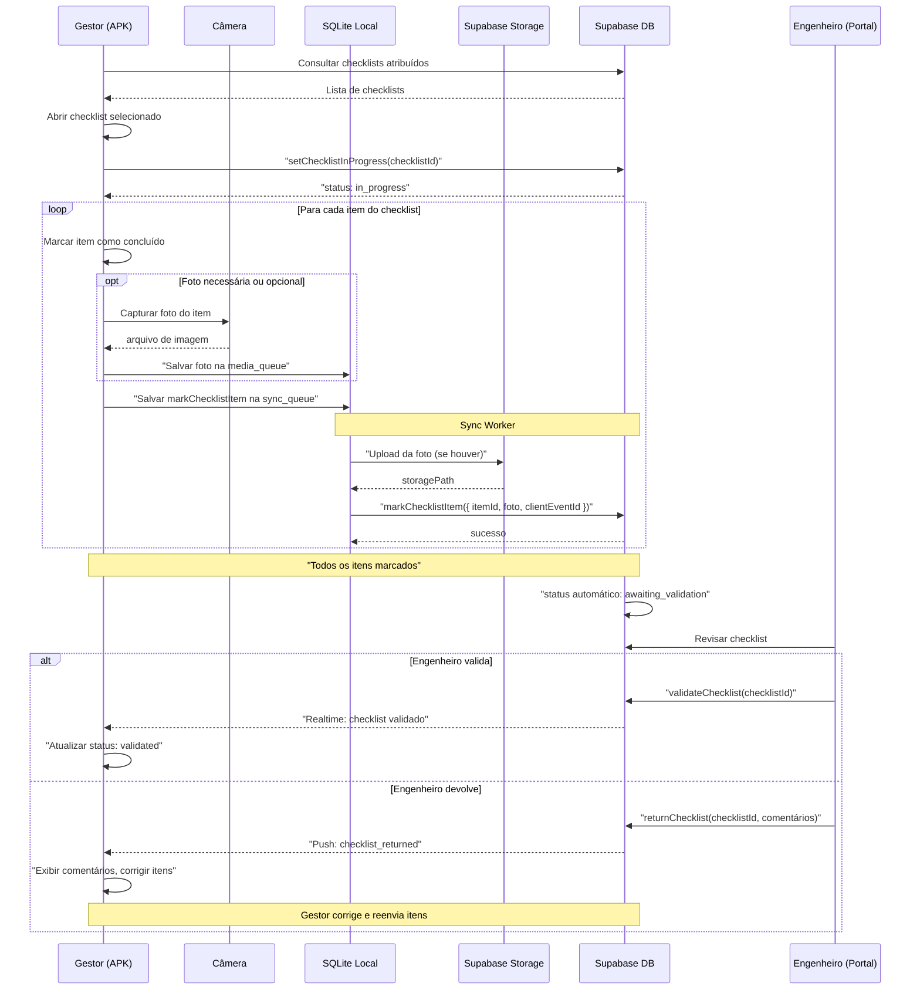
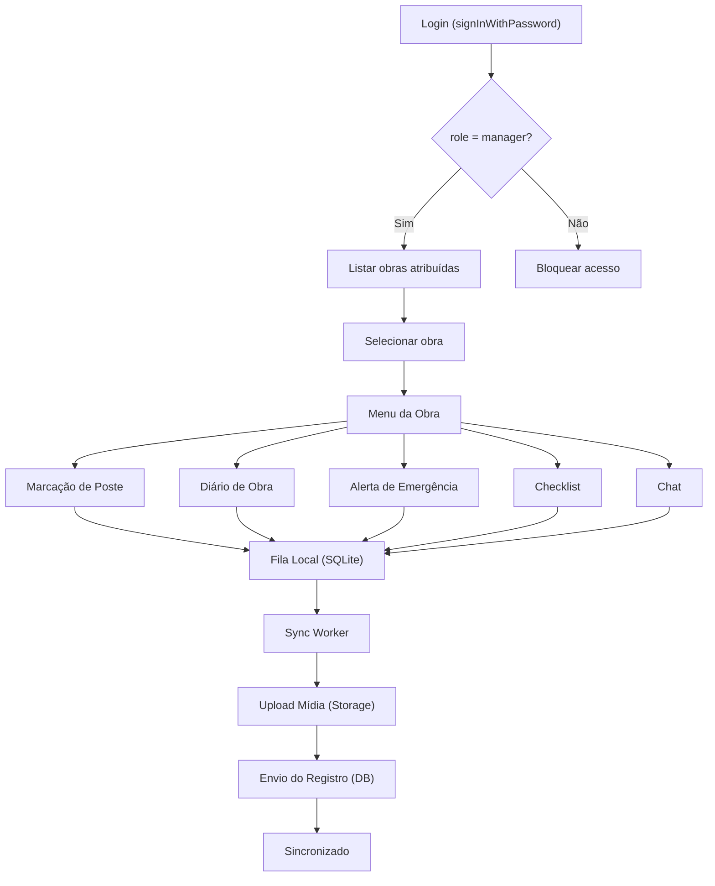

# 00 — Diagramas de Fluxo do APK

> **Versão do contrato:** `v1.0.0-web-complete`

Diagramas dos 5 fluxos principais do APK Android usando sintaxe Mermaid.

---

## 1. Login + Listagem de Obras

---

## 2. Marcação de Poste (Pole Installation)

---

## 3. Diário de Obra (Daily Log)

---

## 4. Alerta de Emergência

---

## 5. Checklist

---

## Fluxo Geral — Visão Macro

